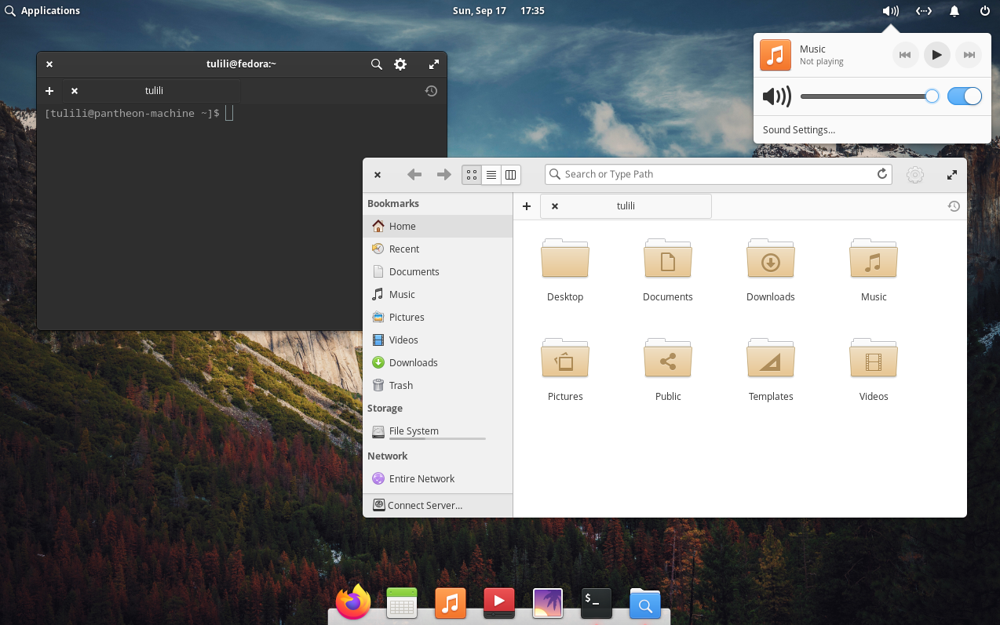

# pantheon 

**This image is experimental**, although everything seems to be working fine.

To try this image, you can use an existing Fedora Silverblue install.

## Rebase over Fedora Silverblue

    rpm-ostree rebase ostree-image-signed:docker://ghcr.io/ublue-os/pantheon-main:38

or if you have an NVIDIA GPU:

    rpm-ostree rebase ostree-image-signed:docker://ghcr.io/ublue-os/pantheon-nvidia:38
